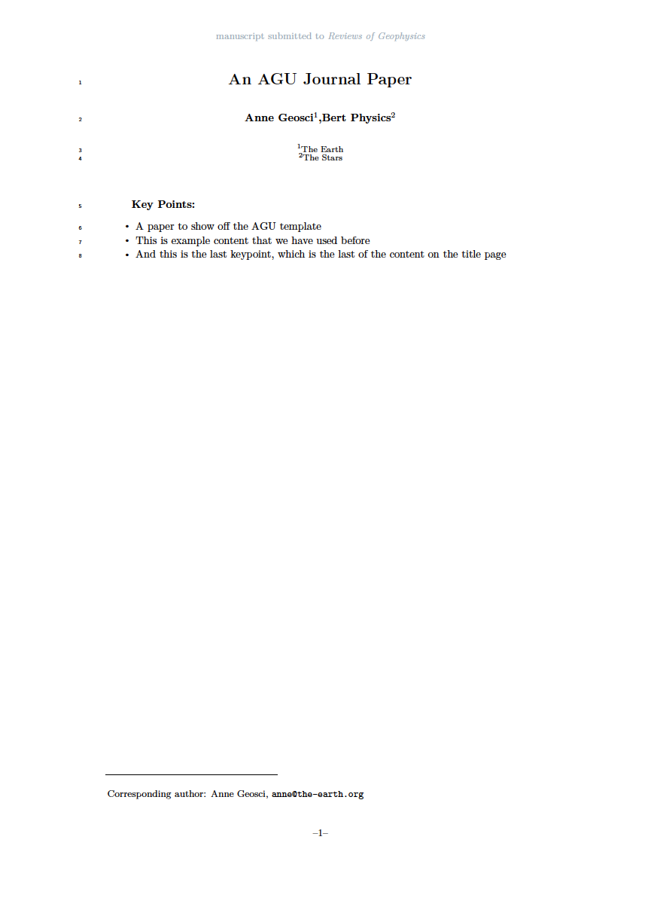

# AGU Journal

A port of the offical 2019 AGU Journal template.

Ported to a Curvenote template with minimal modifications.

- Author: American Geophysical Union (AGU)
- Author Website: https://www.agu.org/
- License: CC-BY-4.0
- [AGU Text Requirements & download link](https://www.agu.org/Publish-with-AGU/Publish/Author-Resources/Text-requirements)
- [Submission Guidelines](https://www.agu.org/-/media/Files/Publications/Latex_submission_guidelines_Sept52019.pdf)
- [List of changes](PORT.md) made while porting the template

## Features

- Draft mode
- Title
- Authors, Affiliation
- Author Notes (Optional)
- Corresponding Author
- Journal Name
- Keypoints
- Plain Language Summary (Optional)
- Track changes
- Acknowledgments
- Custom cite commands (cite, citeA) others () not allowed

## TODO

- [ ] option - author notes
- [ ] track changes
