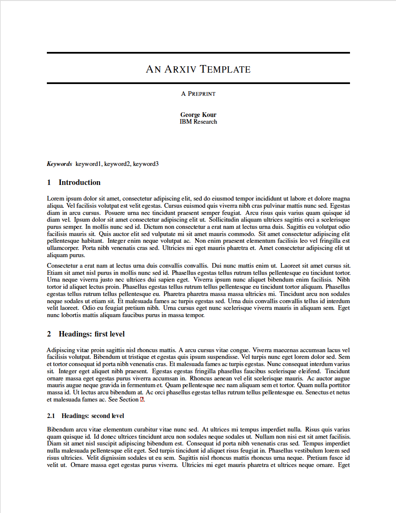

# arXiv (NIPS)

A template for pre-prints based on the arXiv submission guide, created by [George Kour](https://github.com/kourgeorge) and ported to a Curvenote template.

- Author: [George Kour](https://github.com/kourgeorge)
- License: MIT
- [Source Repository](https://github.com/kourgeorge/arxiv-style)
- [List of changes](PORT.md) made while porting the template
