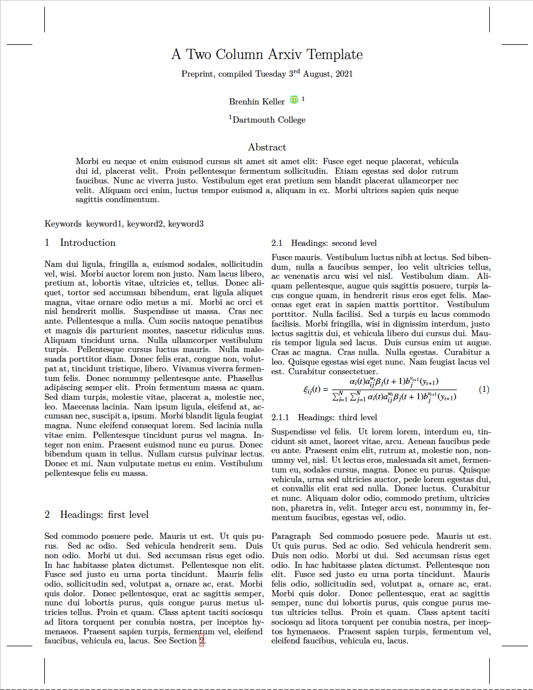

# Arxiv (Two Column)

A template for pre-prints based on the Arxiv submission guide, created by [Brenhin Keller](https://github.com/brenhinkeller) and ported to a Curvenote template.

- Author: [Brenhin Keller](https://github.com/brenhinkeller)
- License: MIT
- [Source Repository](https://github.com/brenhinkeller/preprint-template.tex)
- [List of changes](PORT.md) made while porting the template

## TODO

- [ ] ORCID ID Support
- [ ] option - watermark
- [ ] option - line_numbers
- [ ] option - corresponding author
- [ ] option - bibstyle: Geology
