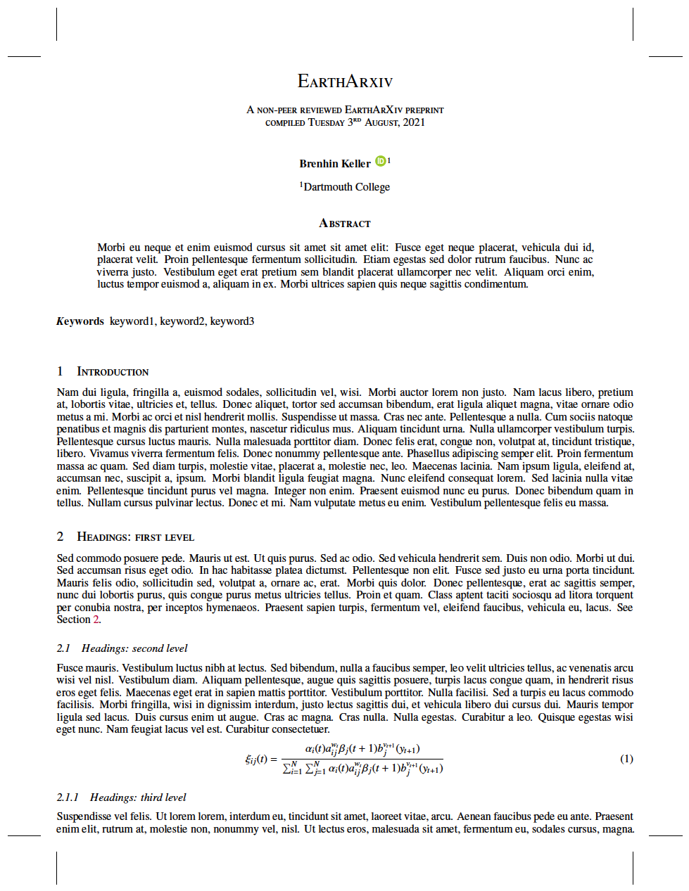

# EarthArXiv (Two Column)

A template for EarthArXiv preprints with the AGU bibstyles and the required header text.
Originally created by [Brenhin Keller](https://github.com/brenhinkeller), ported to a Curvenote template with modifications including turning this into a single column format.

- Author: [Brenhin Keller](https://github.com/brenhinkeller)
- License: CC-BY-4.0
- [Source Repository](https://github.com/brenhinkeller/preprint-template.tex)
- [List of changes](PORT.md) made while porting the template

## TODO

- [ ] option - corresponding author
- [ ] option - watermark
- [ ] option - line_numbers
