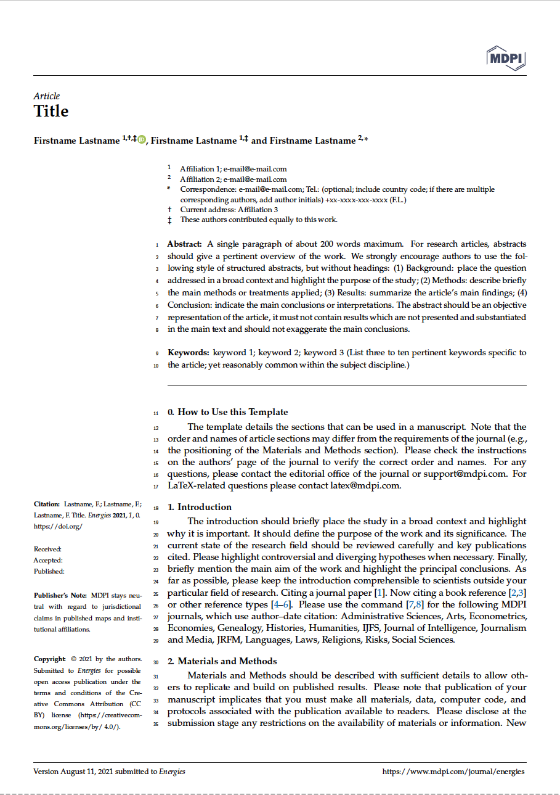

# MDPI Energies Journal

A port of the MDPI Journal template with minimal modifications.

In Lieu of user options this is currently hard coded to the [Energies Journal](https://www.mdpi.com/journal/energies), but the template itself covers submission to 394 different Open Access MDPI journals

- Author: MDPI
- Author Website: https://www.mdpi.com/
- License: Unknown
- [List of changes](PORT.md) made while porting the template

## Features

- Title
- Authors, Affiliations, Orcid
- TAGGED sections:
  - `notes`
  - `Summary`
  - `abstract`
  - `supplementary`
  - `author_contributions`
  - `funding`
  - `institutional_review`
  - `informed_consent`
  - `data_availability`
  - `acknowledgments`
  - `conflicts`
  - `sample_availabilty`
  - `abbreviations`
  - `appendix`
- OPTION: can mark as an extended version of a conference paper
- OPTION: `chicago` for Chicago style author citation
- OPTION: Corresponding Author
- Special fields PACS, MSC, and JEL
- Journal Specific Content (conditional tagged/options)
  - Diversity - OPTION `lsid` for diversity Journal (needs URL)
  - Applied Sciences - TAGGED `feature_application`
  - Data
    - OPTION `dataset` DOI
    - OPTION `dataset_license`
  - Toxins - TAGGED `key_contribution`
  - Encyclopedia
    - TAGGED Abstract is used as `encyclopediadef`
    - OPTIONS `entry_link`
- pdftex option for pdflatex builds, if not LaTeX plus dvi2pdf
- pdfout=1 for arXiv
- Variable manuscript type
- Mathematics environments encouraged

## TODO

- [ ] set journal name as an option, remove hard coded value and bring back in if statements marked with TODO
- [ ] set manuscript type as an option
- [ ] external editor
- [ ] leverage mathematics environments
- [ ] tagged `notes` multiple blocks as a list? or expect bullets? or?
- [ ] option mark as an extended version of a conference paper
- [ ] option for special fields PACS, MSC, and JEL
- [ ] LSID Option for diversity Journal (needs URL)
- [ ] different citation styles for certain journals
