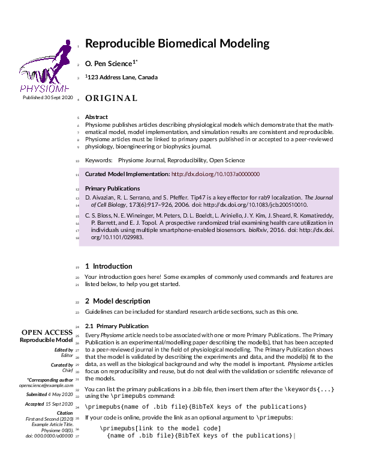

# Physiome Journal

Physiome publishes articles describing physiological models which demonstrate that the mathematical model, model implementation, and simulation results are consistent and reproducible. Physiome articles must be linked to primary papers published in or accepted to a peer-reviewed physiology, bioengineering or biophysics journal.

- Author: Physiome Journal
- License: CC-BY-4.0
- [Source Repository](https://www.overleaf.com/latex/templates/physiome-journal-article-template/kfbqwxxmtsfv)
