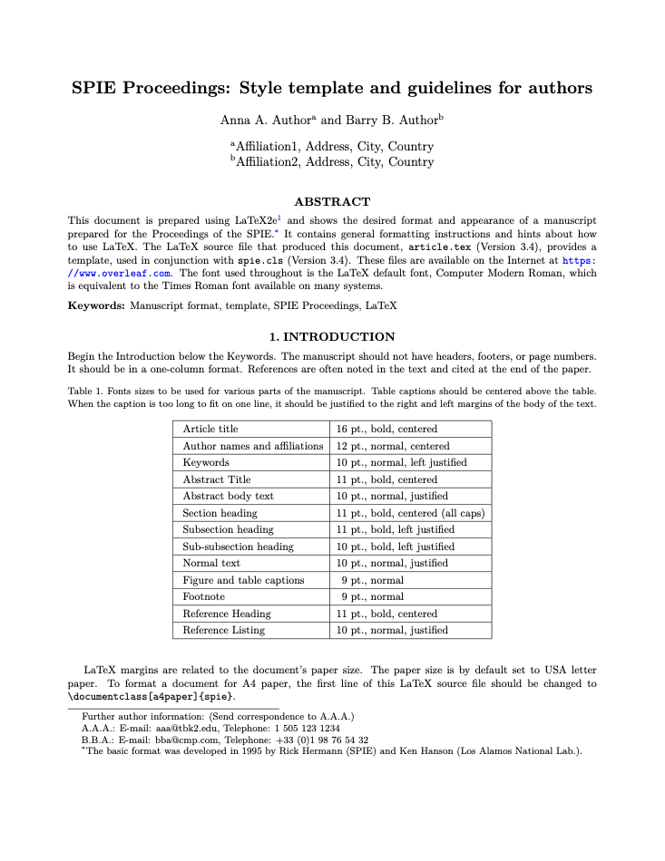

# SPIE Proceedings

A template using the styles provided by the SPIE for publications in their proceedings, ported to a Curvenote template.

- Author: [SPIE](https://www.spie.org/)
- License: CC-BY-4.0
- [Source](https://spie.org/Documents/Publications/spie-proceedings-style.zip)
- [List of changes](PORT.md) made while porting the template

## TODO

- [ ] make affiliations optional, and counts correct when missing
