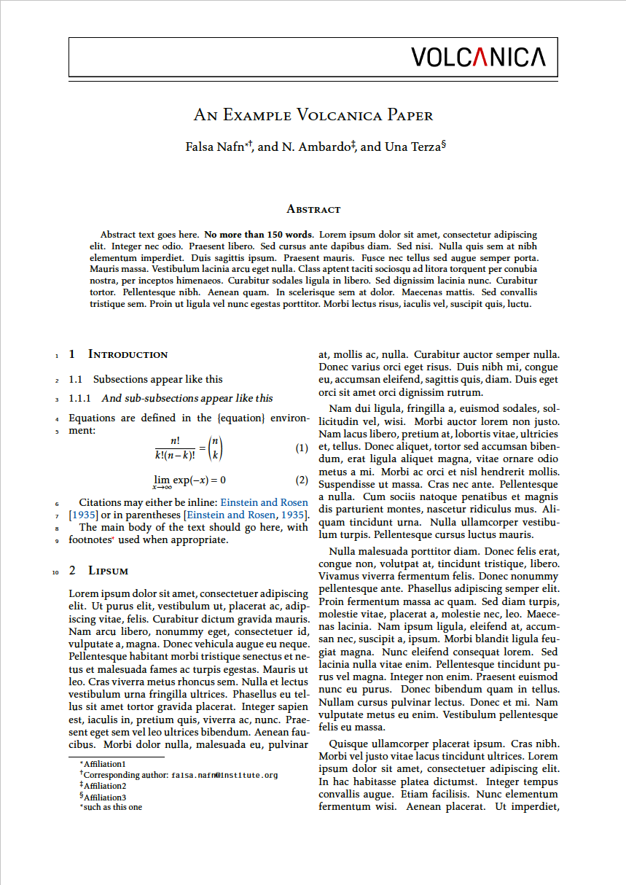

# Volcanica Journal

A port of the Volcanica Journal template with minimal modifications.

- Author: Volcanica
- Author Website: https://jvolcanica.org/
- License: Unknown
- [Submission Guidelines](http://www.jvolcanica.org/ojs/index.php/volcanica/about/submissions)
- [List of changes](PORT.md) made while porting the template

## Features

- Two Column
- Two Side
- A4 paper
- Title
- First Author or Blind (user option)
- Authors, Affiliations or Blind (user option)
- OPTION: Draft
- OPTION: Corresponding Author
- OPTION: Draft watermark
- OPTION: Line numbers
- TAGGED: Abstract `abstract`
- TAGGED: Second language abstract `?` (to be implemented)
- TAGGED: Acknowledgments `acknowledgments`
- TAGGED: Author Contributions `author-contributions`
- TAGGED: Data Availability `data-availability`

## TODO

- [ ] option - second language abstract
- [ ] reproducible build
